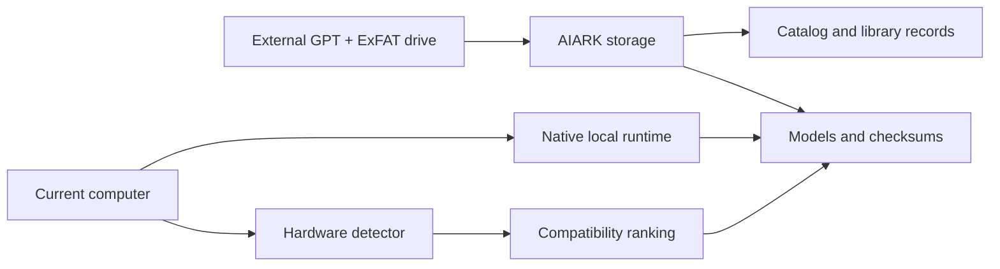

# AiArk

### A portable, verified library of AI models on one external drive.

[](https://github.com/magamadovnurid/AiArk/actions/workflows/ci.yml)
[](https://github.com/magamadovnurid/AiArk/releases)
[](#download)
[](LICENSE)

[Русская версия](docs/README.ru.md) · [Download](https://github.com/magamadovnurid/AiArk/releases) · [Documentation](docs/ARCHITECTURE.md) · [Roadmap](docs/ROADMAP.md)

AiArk turns a 4 TB or larger external drive into a portable home for AI model files. Connect the same drive to Windows, macOS, or Linux: AiArk identifies the computer, evaluates which models fit its hardware, verifies every downloaded artifact, and keeps the platform-specific runtime on the computer where it belongs.

> [!IMPORTANT]
> AiArk does **not** format disks automatically. Scanning and preparation previews are read-only. The MVP only creates its own `AIARK/` folder after an exact, disk-specific confirmation. Formatting remains a deliberate, manual action in the operating system's disk utility.

## Why AiArk exists

Large model files are expensive to download repeatedly and quickly consume internal storage. Copying them manually between machines also makes it difficult to know whether a file is complete, compatible, or trustworthy. AiArk provides one consistent workflow:

1. connect an external drive;
2. inspect the drive and computer without writing anything;
3. see which models fit the detected RAM, GPU, VRAM, OS, and architecture;
4. prepare a predictable storage structure after explicit confirmation;
5. download or resume models in verified chunks;
6. use a native runtime installed locally for the current platform.

## MVP capabilities

| Area | What works today |
|---|---|
| External disks | Physical external-drive detection on Windows, macOS, and Linux |
| Safety | Dry-run preview, physical-disk fingerprint, exact confirmation, re-scan before writing |
| Portable profile | Recommends **GPT + ExFAT + at least 4 TB** for cross-platform read/write access |
| Hardware | Detects OS, architecture, CPU, RAM, GPU, VRAM or unified memory, and accelerator backend |
| Compatibility | Ranks manifest models as recommended, compatible, limited, or incompatible with reasons |
| Downloads | HTTP range chunks, retry, resume, SHA-256 verification, and repair of known bad chunks |
| Model storage | Keeps verified model files, manifests, library records, datasets, and exports on the ark |
| Runtimes | Resolves and installs a native `llama.cpp` build in local application data |
| Local network | Discovers nearby AiArk nodes without granting remote execution |
| Interfaces | Minimal Electron desktop app plus a scriptable CLI |

Automatic disk formatting, remote execution, and peer-to-peer model transfer are intentionally outside the current MVP. See the [roadmap](docs/ROADMAP.md).

## Download

Open the [Releases page](https://github.com/magamadovnurid/AiArk/releases) and choose the file for your computer:

| Platform | Package | Use it when |
|---|---|---|
| Windows x64 | `AiArk-Setup-<version>-win-x64.exe` | You want a normal installed application |
| Windows x64 | `AiArk-Portable-<version>-win-x64.exe` | You want to run AiArk without installation |
| macOS Apple Silicon | `AiArk-<version>-mac-arm64.dmg` | Your Mac has an M-series processor |
| macOS Intel | `AiArk-<version>-mac-x64.dmg` | Your Mac has an Intel processor |
| Linux x64 | `AiArk-<version>-linux-x86_64.AppImage` | You want a portable Linux application |
| Debian/Ubuntu x64 | `AiArk-<version>-linux-amd64.deb` | You want a system package |

Every release includes `SHA256SUMS.txt`. Compare the checksum before running a downloaded file.

> [!WARNING]
> The `0.x` builds are public MVP pre-releases and are currently unsigned. macOS Gatekeeper or Windows SmartScreen may show a warning. Only download files from this repository's Releases page and verify the checksum. Code signing and notarization are tracked in the roadmap.

## Prepare an ark

The recommended universal disk profile is:

- capacity: **4 TB decimal or larger**;
- partition table: **GUID Partition Table (GPT)**;
- filesystem: **ExFAT**;
- volume mounted with write access.

ExFAT is used for portability and files larger than 4 GB. Native executables, Python environments, and platform libraries are not stored on ExFAT; AiArk installs runtimes in local application data instead.

In the desktop app:

1. connect the external drive;
2. launch AiArk — a single detected drive is selected automatically;
3. review the status and dry-run guidance;
4. if formatting is needed, back up the drive and do it manually in the system disk utility;
5. type the displayed `PREPARE AIARK <fingerprint>` phrase;
6. select **Create AiArk**.

Preparation is refused when the target is too small, is an internal or system disk, is not GPT, is not ExFAT, is read-only, disappears during the operation, or changes fingerprint.

## Where data lives



Portable data on the external drive:

```text
AIARK/
├── ark.json
├── .aiark/
│   ├── downloads/
│   ├── checksums/
│   └── logs/
├── manifests/catalog.json
├── library/index.json
├── models/
│   ├── gguf/
│   ├── onnx/
│   └── safetensors/
├── datasets/
├── exports/
└── docs/
```

Native runtimes on each computer:

| OS | Local runtime directory |
|---|---|
| macOS | `~/Library/Application Support/AiArk/runtimes` |
| Windows | `%LOCALAPPDATA%\AiArk\runtimes` |
| Linux | `$XDG_DATA_HOME/aiark/runtimes` or `~/.local/share/aiark/runtimes` |

## CLI

Requirements: Node.js 20 or newer.

```bash
npm ci
npm run build

# Hardware, disks, and compatibility
node dist/cli.js scan --json

# Read-only disk preview
node dist/cli.js disk preview --disk <disk-id>
node dist/cli.js disk format-preview --disk <disk-id> --json

# Prepare an already compatible disk
node dist/cli.js disk prepare \
  --disk <disk-id> \
  --confirm "PREPARE AIARK <fingerprint>"

# Model operations
node dist/cli.js model download <model-id> --ark /path/to/AIARK
node dist/cli.js model verify <model-id> --ark /path/to/AIARK
node dist/cli.js model repair <model-id> --ark /path/to/AIARK

# Native runtime and local peers
node dist/cli.js runtime plan llama.cpp --json
node dist/cli.js runtime install llama.cpp
node dist/cli.js cluster discover --timeout 2000 --json
```

For authenticated Hugging Face downloads, set `HF_TOKEN` in the process environment. AiArk uses it only as an HTTP authorization header and never writes it to the ark.

For a previously prepared, large macOS vault, an optional [unattended download watchdog](docs/VAULT_WATCHDOG.md) can resume only unfinished public files after a process or network interruption. It requires the exact external disk identity and never formats a disk.

## Development

```bash
npm ci
npm run dev       # build and open the desktop app
npm run check     # TypeScript, test suite, and production bundles
npm run dist:dir  # unpacked desktop build for the current OS
npm run dist      # native installer packages for the current OS
```

Pull requests run validation and native packaging on Windows, macOS, and Linux. A version tag such as `v0.1.0` builds release artifacts for every supported target, generates checksums, and publishes a GitHub pre-release automatically.

## Project documentation

- [Architecture and trust boundaries](docs/ARCHITECTURE.md)
- [Disk and write safety](docs/SAFETY.md)
- [Model manifest specification](docs/MODEL_MANIFEST.md)
- [macOS unattended vault download](docs/VAULT_WATCHDOG.md)
- [MVP boundaries and roadmap](docs/ROADMAP.md)
- [Release process](docs/RELEASING.md)
- [Contributing](CONTRIBUTING.md)
- [Code of Conduct](CODE_OF_CONDUCT.md)
- [Security policy](SECURITY.md)
- [Changelog](CHANGELOG.md)

## License

AiArk is released under the [MIT License](LICENSE). Model files retain their own licenses; adding a model to the catalog does not change or replace the model publisher's terms.
